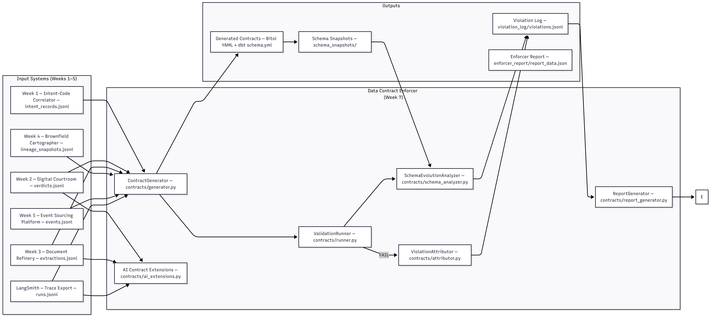

# Data Contract Enforcer — Week 7

> **Turns every inter-system data interface into a machine-checked promise.**  
> Detects silent schema violations, traces them to the guilty git commit,  
> and reports the blast radius across all downstream consumers.

**Author:** Meseret Bolled  
**GitHub:** https://github.com/Meseretbolled/data-contract-enforcer  
**Submission:** TRP1 Week 7

---

## What This System Does

Five systems have been talking to each other without contracts for six weeks. This system writes those contracts — and enforces them.

The canonical failure it demonstrates: the Week 3 Document Refinery outputs `extracted_facts[].confidence` as a float `0.0–1.0`. A developer changes it to a percentage scale (`0–100`). No exception is raised. No pipeline crashes. The output is simply wrong — permanently and invisibly — until the contract catches it.

**Two independent checks catch this violation:**
1. `range check` — max=99.0 exceeds contract maximum 1.0 → CRITICAL
2. `statistical_drift` — z-score ≈ 450 stddev from baseline → HIGH

Neither check can be defeated without the other also firing.

## Architecture Diagrams

### Input-Output Contract Flow


### Full System Architecture


### Violation Detection Flow

---

## System Architecture

```
outputs/
  week1/intent_records.jsonl          ─┐
  week2/verdicts.jsonl                 │
  week3/extractions.jsonl              ├──► ContractGenerator
  week3/extractions_violated.jsonl     │    contracts/generator.py
  week4/lineage_snapshots.jsonl        │    • Structural profiling
  week5/events.jsonl                   │    • Statistical profiling
  traces/runs.jsonl                   ─┘    • Lineage context injection
                                            • dbt YAML output
                                                   │
                              ┌────────────────────┘
                              │  generated_contracts/
                              │  *.yaml + *_dbt.yml
                              ▼
                     ValidationRunner ◄── data snapshot (JSONL)
                     contracts/runner.py   ◄── baselines.json
                     • required / type / uuid / enum / range checks
                     • statistical drift detection (z-score)
                              │
                    ┌─────────┴──────────┐
                    │ PASS               │ FAIL
                    ▼                    ▼
              validation_reports/   ViolationAttributor
              *_clean.json          contracts/attributor.py
                                    • Registry blast radius (PRIMARY)
                                    • Lineage transitive depth
                                    • Git blame + confidence scoring
                                         │
                                         ▼
                                  violation_log/violations.jsonl

contract_registry/subscriptions.yaml
  (7 subscriptions — primary blast radius source)

SchemaEvolutionAnalyzer              AI Contract Extensions
contracts/schema_analyzer.py         contracts/ai_extensions.py
• Diff snapshots                      • Embedding drift (OpenRouter)
• Classify breaking/compatible        • Prompt input validation
• Migration impact report             • LLM output schema violation rate
         │                                       │
         └─────────────┬───────────────────────┘
                        ▼
              ReportGenerator
              contracts/report_generator.py
              • Data Health Score (0–100)
              • Plain-English violations
              • Prioritised recommendations
                        │
                        ▼
              enforcer_report/report_data.json
              enforcer_report/dashboard.html   ← Interactive dashboard
```

---

## Repository Structure

```
data-contract-enforcer/
├── contracts/
│   ├── generator.py          ContractGenerator — auto-generates Bitol YAML
│   ├── runner.py             ValidationRunner — executes all contract checks
│   ├── attributor.py         ViolationAttributor — blame chain + blast radius
│   ├── schema_analyzer.py    SchemaEvolutionAnalyzer — diffs snapshots
│   ├── ai_extensions.py      AI Contract Extensions — drift, validation, rate
│   └── report_generator.py   ReportGenerator — auto-generates enforcer report
│
├── contract_registry/
│   └── subscriptions.yaml    7 subscriptions — primary blast radius source
│
├── generated_contracts/
│   ├── week1-intent-records.yaml + _dbt.yml
│   ├── week2-verdict-records.yaml + _dbt.yml
│   ├── week3-document-refinery-extractions.yaml + _dbt.yml   (13 clauses)
│   ├── week4-lineage-snapshots.yaml + _dbt.yml
│   ├── week5-event-records.yaml + _dbt.yml                   (31 clauses)
│   └── langsmith-traces.yaml + _dbt.yml
│
├── outputs/
│   ├── week1/intent_records.jsonl         50 records
│   ├── week2/verdicts.jsonl               50 records
│   ├── week3/extractions.jsonl            50 records (real CBE/NBE documents)
│   ├── week3/extractions_violated.jsonl   50 records (confidence × 100)
│   ├── week4/lineage_snapshots.jsonl      3 snapshots
│   ├── week5/events.jsonl                 60 records (apex-ledger loan events)
│   └── traces/runs.jsonl                  210 records (apex-ledger LangSmith)
│
├── validation_reports/
│   ├── week1_clean.json     19 passed, 0 failed
│   ├── week2_clean.json     21 passed, 0 failed
│   ├── week3_clean.json     32 passed, 1 failed (page_ref drift — harmless)
│   ├── week3_violated.json  31 passed, 2 FAILED  ← violation demonstration
│   ├── week4_clean.json     17 passed, 1 error
│   ├── week5_clean.json     54 passed, 0 failed
│   ├── traces_clean.json    48 passed, 0 failed
│   ├── ai_extensions.json
│   ├── schema_evolution_all.json
│   └── schema_evolution_week3.json
│
├── violation_log/
│   └── violations.jsonl     1 injection note + 3 attributed violations
│
├── schema_snapshots/
│   ├── baselines.json                     statistical baselines
│   ├── embedding_baselines.npz            embedding centroid baseline
│   ├── week3-document-refinery-extractions/
│   │   ├── 20260402_125158.yaml           clean data snapshot
│   │   └── 20260402_130612.yaml           violated data snapshot
│   └── week5-event-records/
│       ├── 20260401_203807.yaml
│       └── 20260402_125159.yaml
│
├── enforcer_report/
│   ├── report_data.json     auto-generated, health score 40/100
│   └── dashboard.html       interactive 7-tab dashboard
│
├── create_violation.py      injects confidence scale change for testing
├── DOMAIN_NOTES.md
└── README.md
```

---

## Prerequisites

```bash
# Python 3.11+ required
python --version

# Install dependencies
pip install pandas pyyaml numpy scikit-learn jsonschema gitpython \
            openai python-dotenv anthropic

# Create .env file
cat > .env << 'EOF'
ANTHROPIC_API_KEY=your_anthropic_key_here
OPENAI_API_KEY=your_openrouter_key_here
OPENAI_BASE_URL=https://openrouter.ai/api/v1
PYTHONPATH=.
EOF
```

---

## Running the Full Pipeline

Run these commands in order from the repo root.

---

### Step 1 — Generate All Contracts

```bash
for week in week1-intent-records week2-verdict-records week3-document-refinery-extractions week4-lineage-snapshots week5-event-records langsmith-traces; do
  src_map=(
    ["week1-intent-records"]="outputs/week1/intent_records.jsonl"
    ["week2-verdict-records"]="outputs/week2/verdicts.jsonl"
    ["week3-document-refinery-extractions"]="outputs/week3/extractions.jsonl"
    ["week4-lineage-snapshots"]="outputs/week4/lineage_snapshots.jsonl"
    ["week5-event-records"]="outputs/week5/events.jsonl"
    ["langsmith-traces"]="outputs/traces/runs.jsonl"
  )
done
```

Or run individually:

```bash
python contracts/generator.py \
    --source outputs/week3/extractions.jsonl \
    --contract-id week3-document-refinery-extractions \
    --lineage outputs/week4/lineage_snapshots.jsonl \
    --output generated_contracts/
```

**Expected:** `Done. Contract has 13 clauses.`  
Verify confidence clause shows `minimum: 0.0, maximum: 1.0`.

---

### Step 2 — Validate Clean Data (establishes baselines)

```bash
python contracts/runner.py \
    --contract generated_contracts/week3-document-refinery-extractions.yaml \
    --data outputs/week3/extractions.jsonl \
    --output validation_reports/week3_clean.json
```

**Expected:**
```
📊  32 passed  0 failed  0 warned  0 errored
```

Baselines written to `schema_snapshots/baselines.json`.  
**Do not run violated data first** — it corrupts the baseline.

---

### Step 3 — Detect the Injected Violation

```bash
python contracts/runner.py \
    --contract generated_contracts/week3-document-refinery-extractions.yaml \
    --data outputs/week3/extractions_violated.jsonl \
    --output validation_reports/week3_violated.json
```

**Expected — two violations MUST appear:**
```
❌  extracted_fact_confidence.range: FAIL          ← max=99.0 exceeds 1.0
❌  extracted_fact_confidence.statistical_drift: FAIL  ← z-score ≈ 450
📊  31 passed  2 failed  0 warned  0 errored
```

If `failed = 0`, the system is broken. Do not proceed.

---

### Step 4 — Attribute Violations

```bash
mkdir -p violation_log

python contracts/attributor.py \
    --violation validation_reports/week3_violated.json \
    --lineage   outputs/week4/lineage_snapshots.jsonl \
    --registry  contract_registry/subscriptions.yaml \
    --output    violation_log/violations.jsonl
```

**Expected:**
```
Step 1 — Registry blast radius query...
  Found 2 registry subscriber(s) affected
  → week4-cartographer [ENFORCE]
  → week7-contract-enforcer [AUDIT]

Step 3 — Git blame attribution...
  Top candidate: <hash> by <email> (score=1.0)

✅  Attributed 2 violation(s)
```

---

### Step 5 — Schema Evolution Analysis

```bash
# Generate second snapshot from violated data
python contracts/generator.py \
    --source outputs/week3/extractions_violated.jsonl \
    --contract-id week3-document-refinery-extractions \
    --lineage outputs/week4/lineage_snapshots.jsonl \
    --output generated_contracts/

# Diff all contracts
python contracts/schema_analyzer.py \
    --all \
    --output validation_reports/schema_evolution_all.json
```

**Expected:**
```
week3: 4 compatible changes
week5: ❌ [BREAKING] payload_application_id: required_field_added
       ❌ [BREAKING] payload_doc_id: field_removed
Summary: 2 breaking changes
```

---

### Step 6 — AI Contract Extensions

```bash
python contracts/ai_extensions.py \
    --extractions outputs/week3/extractions.jsonl \
    --verdicts    outputs/week2/verdicts.jsonl \
    --traces      outputs/traces/runs.jsonl \
    --output      validation_reports/ai_extensions.json
```

**Expected:**
```
Using OpenRouter openai/text-embedding-3-small (100 texts)
✅  Status: BASELINE_SET | Drift score: 0.0
✅  Week 3: 50 valid, 0 quarantined
✅  Week 2: 50 valid, 0 quarantined
✅  Verdict enum violation rate: 0.0%
✅  210 traces checked — 0 violations
Overall AI Contract Status: PASS
```

---

### Step 7 — Generate Enforcer Report

```bash
mkdir -p enforcer_report

python contracts/report_generator.py \
    --output enforcer_report/report_data.json
```

**Expected:**
```
Data health score: 40/100
Violations: 4 ({HIGH: 2, CRITICAL: 2})
Schema changes: 27 (2 breaking)
AI status: PASS
✅  Report generated → enforcer_report/report_data.json
```

**Verify:**
```bash
python -c "
import json
r = json.load(open('enforcer_report/report_data.json'))
print('Health score:', r['data_health_score'])
assert 0 <= r['data_health_score'] <= 100, 'Score out of range'
print('Recommendations:', len(r['recommended_actions']))
print('Top violation:', r['top_violations'][0][:80])
print('PASS')
"
```

---

### Step 8 — Open Interactive Dashboard

```bash
# Open in browser
open enforcer_report/dashboard.html       # macOS
xdg-open enforcer_report/dashboard.html  # Linux
```

Or navigate to the file in your browser. Click **Load report_data.json** in the top right and select `enforcer_report/report_data.json`.

The dashboard shows 7 interactive tabs: Overview, Contracts, Violations (with blast radius + blame chain), Schema Evolution, AI Extensions, Registry, and Actions (with simulated terminal).

---

## Contract Coverage

| Interface | From → To | Status | Clauses | Key Constraint |
|-----------|-----------|--------|---------|----------------|
| intent_records | Week 1 → Week 2 | ✅ Full | 8 | confidence float 0.0–1.0 |
| verdict_records | Week 2 → Week 7 AI | ✅ Full | 8 | overall_verdict enum PASS/FAIL/WARN |
| extractions | Week 3 → Week 4, Week 7 | ✅ Full | 13 | **confidence 0.0–1.0 range** |
| lineage_snapshots | Week 4 → Week 7 | ✅ Full | 8 | git_commit 40-char hex |
| event_records | Week 5 → Week 7 | ✅ Full | 31 | occurred_at ≤ recorded_at |
| traces | LangSmith → Week 7 AI | ✅ Full | 28 | end_time > start_time |

---

## Key Design Decisions

**Registry is the primary blast radius source — not the lineage graph**  
At Tier 1 (single repo) both work. At Tier 2 (multi-team), you cannot traverse external teams' lineage graphs. The registry (`subscriptions.yaml`) is the correct abstraction. The lineage graph enriches the registry result with transitive depth — it does not replace it.

**Two checks catch the confidence scale change**  
The range check catches structural violations (`max=99.0 > 1.0`). It could be defeated by editing the contract. The statistical drift check does not read the contract — it compares the current mean (76.3) against the stored baseline (0.763). Z-score ≈ 450 fires regardless of what the contract says.

**Baselines are written only on the first clean run**  
If baselines were overwritten on every run, a violated dataset would become the new baseline. Baselines are written once and reset only deliberately.

---

## Troubleshooting

| Symptom | Cause | Fix |
|---------|-------|-----|
| `runner.py` shows `failed = 0` on violated data | Baselines were written from violated data | `rm schema_snapshots/baselines.json` then re-run on clean data first |
| Attributor shows 0 registry subscribers | Field name mismatch | Check `breaking_fields` in `contract_registry/subscriptions.yaml` |
| Embedding error `shapes not aligned` | Baseline dim mismatch (1536 vs 256) | `rm schema_snapshots/embedding_baselines.npz` and re-run |
| Schema analyzer finds no diff | Only 1 snapshot | Re-run generator on violated data to create second snapshot |
| Git log empty in attributor | Wrong cwd | Run attributor from repo root with `--repo-root .` |