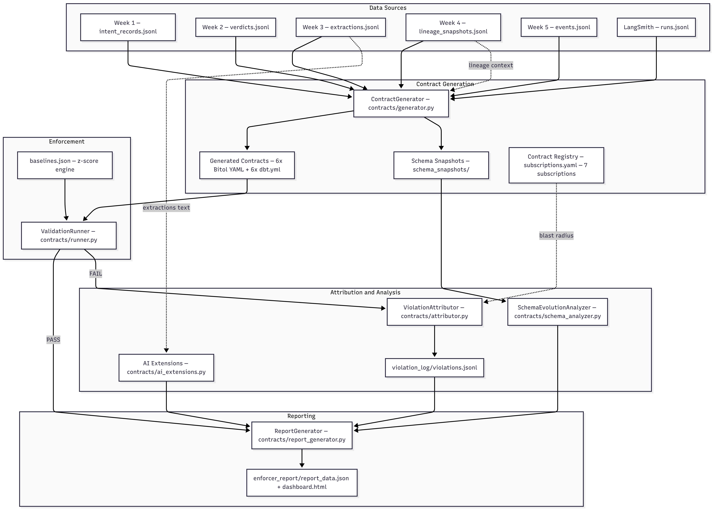
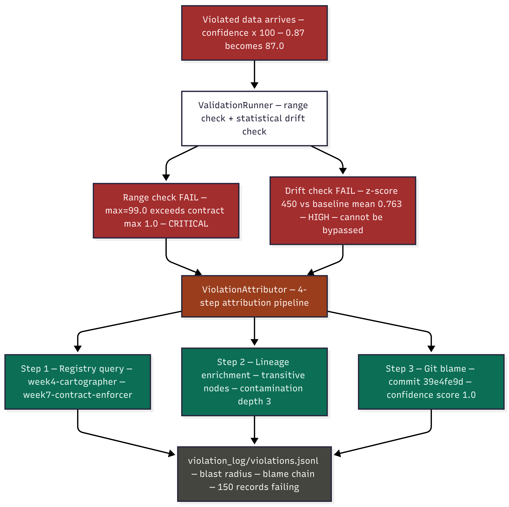

# Data Contract Enforcer — Week 7

> **Turns every inter-system data interface into a machine-checked promise.**  
> Detects silent schema violations, traces them to the guilty git commit,  
> and reports the blast radius across all downstream consumers.

**Author:** Meseret Bolled  
**GitHub:** https://github.com/Meseretbolled/data-contract-enforcer  
**Submission:** TRP1 Week 7

---

## What This System Does

Five systems have been talking to each other without contracts for six weeks. This system writes those contracts — and enforces them.

The canonical failure it demonstrates: the Week 3 Document Refinery outputs `extracted_facts[].confidence` as a float `0.0–1.0`. A developer changes it to a percentage scale (`0–100`). No exception is raised. No pipeline crashes. The output is simply wrong — permanently and invisibly — until the contract catches it.

**Two independent checks catch this violation:**
1. `range check` — max=99.0 exceeds contract maximum 1.0 → **CRITICAL**
2. `statistical_drift` — z-score ≈ 797 stddev from baseline → **HIGH**

Neither check can be defeated without the other also firing. The statistical drift check does not read the contract — it fires regardless of what the contract says.

---

## Architecture Diagrams

### Input-Output Contract Flow

### Full System Architecture

### Violation Detection Flow

---

## System Architecture

\`\`\`
outputs/
  week1/intent_records.jsonl          ─┐
  week2/verdicts.jsonl                 │
  week3/extractions.jsonl              ├──► ContractGenerator
  week3/extractions_violated.jsonl     │    contracts/generator.py
  week4/lineage_snapshots.jsonl        │    • Step 1: Load JSONL
  week5/events.jsonl                   │    • Step 2: Flatten nested records
  traces/runs.jsonl                   ─┘    • Step 3: Statistical profiling
                                            • Step 4: LLM annotation (OpenRouter)
                                            • Step 5: Lineage context injection
                                            • Step 6: Build Bitol YAML
                                            • Step 7: Generate dbt schema.yml
                                            • Step 8: Save timestamped snapshot
                                                   │
                              ┌────────────────────┘
                              │  generated_contracts/
                              │  *.yaml + *_dbt.yml
                              ▼
                     ValidationRunner ◄── data snapshot (JSONL)
                     contracts/runner.py   ◄── baselines.json
                     --mode AUDIT|WARN|ENFORCE
                     • required / type / uuid / enum / range checks
                     • statistical drift detection (z-score)
                     • pipeline_action: PASS | QUARANTINE | BLOCK
                              │
                    ┌─────────┴──────────┐
                    │ PASS               │ FAIL → BLOCK (ENFORCE mode)
                    ▼                    ▼
              validation_reports/   ViolationAttributor
              *_clean.json          contracts/attributor.py
                                    • Registry blast radius (PRIMARY source)
                                    • Lineage transitive BFS depth
                                    • Git blame + confidence scoring
                                         │
                                         ▼
                                  violation_log/violations.jsonl

contract_registry/subscriptions.yaml
  7 subscriptions — tier 1/2/3, failure_mode_description, on_violation_action

SchemaEvolutionAnalyzer              AI Contract Extensions
contracts/schema_analyzer.py         contracts/ai_extensions.py
• Diff consecutive snapshots          • Embedding drift (OpenRouter)
• Classify BREAKING / COMPATIBLE      • Prompt input schema validation
• Migration checklist + rollback      • LLM output violation rate
• Per-consumer failure analysis       • Writes WARN/FAIL to violation_log
         │                                       │
         └─────────────┬───────────────────────┘
                        ▼
              ReportGenerator
              contracts/report_generator.py
              • Data Health Score (0–100)
              • Plain-English violations
              • Per-consumer failure mode analysis
              • Prioritised recommendations
              • Week 8 Sentinel compatibility
                        │
                        ▼
              enforcer_report/report_data.json
\`\`\`

---

## Repository Structure

\`\`\`
data-contract-enforcer/
├── contracts/
│   ├── generator.py          ContractGenerator — 8-step auto-generation
│   ├── runner.py             ValidationRunner — --mode AUDIT/WARN/ENFORCE
│   ├── attributor.py         ViolationAttributor — blast radius + git blame
│   ├── schema_analyzer.py    SchemaEvolutionAnalyzer — snapshot diffing
│   ├── ai_extensions.py      AI Contract Extensions — drift, validation, rate
│   └── report_generator.py   ReportGenerator — health score + 5 sections
│
├── contract_registry/
│   └── subscriptions.yaml    7 subscriptions — tier + failure_mode + on_violation
│
├── generated_contracts/
│   ├── week1-intent-records.yaml + _dbt.yml               (8 clauses)
│   ├── week2-verdict-records.yaml + _dbt.yml              (8 clauses)
│   ├── week3-document-refinery-extractions.yaml + _dbt.yml (13 clauses)
│   ├── week4-lineage-snapshots.yaml + _dbt.yml            (8 clauses)
│   ├── week5-event-records.yaml + _dbt.yml                (31 clauses)
│   └── langsmith-traces.yaml + _dbt.yml                   (28 clauses)
│
├── outputs/
│   ├── week1/intent_records.jsonl         50 records
│   ├── week2/verdicts.jsonl               50 records
│   ├── week3/extractions.jsonl            50 records (real CBE/NBE documents)
│   ├── week3/extractions_violated.jsonl   50 records (confidence x100 injected)
│   ├── week4/lineage_snapshots.jsonl      3 snapshots (jaffle-shop lineage)
│   ├── week5/events.jsonl                 60 records (apex-ledger loan events)
│   └── traces/runs.jsonl                  210 records (apex-ledger LangSmith)
│
├── validation_reports/
│   ├── week1_clean.json      19 passed, 0 failed
│   ├── week2_clean.json      21 passed, 0 failed
│   ├── week3_clean.json      30 passed, 0 failed  ← baselines established here
│   ├── week3_violated.json   33 passed, 2 FAILED  ← core violation evidence
│   ├── week4_clean.json      18 passed, 0 failed
│   ├── week5_clean.json      54 passed, 0 failed
│   ├── traces_clean.json     48 passed, 0 failed
│   ├── ai_extensions.json    Overall: PASS
│   └── schema_evolution_all.json
│
├── violation_log/
│   └── violations.jsonl      attributed violations with blast radius + git blame
│
├── schema_snapshots/
│   ├── baselines.json                     statistical baselines (from clean data)
│   ├── embedding_baselines.npz            embedding centroid baseline
│   └── <contract-id>/<timestamp>.yaml    timestamped snapshots (2+ per contract)
│
├── enforcer_report/
│   └── report_data.json      health score 70/100, auto-generated
│
├── assets/
│   ├── Input-Output Contract Flow.png
│   ├── architecture_overview.png
│   └── violation_flow.png
│
├── create_violation.py       injects confidence x100 scale change
├── DOMAIN_NOTES.md
└── README.md
\`\`\`

---

## Prerequisites

\`\`\`bash
# Python 3.11+ required
python --version

# Install dependencies
pip install pandas pyyaml numpy scikit-learn openai python-dotenv gitpython

# Create .env file
cat > .env << 'EOF'
OPENAI_API_KEY=your_openrouter_key_here
OPENAI_BASE_URL=https://openrouter.ai/api/v1
EOF
\`\`\`

---

## Running the Full Pipeline

Run these commands in order from the repo root.

### Step 1 — Generate All Contracts

\`\`\`bash
python contracts/generator.py \
    --source outputs/week1/intent_records.jsonl \
    --contract-id week1-intent-records \
    --lineage outputs/week4/lineage_snapshots.jsonl \
    --output generated_contracts/

python contracts/generator.py \
    --source outputs/week2/verdicts.jsonl \
    --contract-id week2-verdict-records \
    --lineage outputs/week4/lineage_snapshots.jsonl \
    --output generated_contracts/

python contracts/generator.py \
    --source outputs/week3/extractions.jsonl \
    --contract-id week3-document-refinery-extractions \
    --lineage outputs/week4/lineage_snapshots.jsonl \
    --output generated_contracts/

python contracts/generator.py \
    --source outputs/week4/lineage_snapshots.jsonl \
    --contract-id week4-lineage-snapshots \
    --lineage outputs/week4/lineage_snapshots.jsonl \
    --output generated_contracts/

python contracts/generator.py \
    --source outputs/week5/events.jsonl \
    --contract-id week5-event-records \
    --lineage outputs/week4/lineage_snapshots.jsonl \
    --output generated_contracts/

python contracts/generator.py \
    --source outputs/traces/runs.jsonl \
    --contract-id langsmith-traces \
    --lineage outputs/week4/lineage_snapshots.jsonl \
    --output generated_contracts/
\`\`\`

**Expected — LLM annotation fires:**
\`\`\`
Step 4 — LLM annotation of ambiguous columns ...
  🤖  LLM annotating 2 ambiguous column(s) via OpenRouter: [...]
  🤖  Annotated 'extracted_fact_text': The text extracted from a document...
\`\`\`

Use `--no-llm` to skip annotation if no API key is available.

---

### Step 2 — Validate All Weeks Clean (AUDIT mode)

\`\`\`bash
python contracts/runner.py \
    --contract generated_contracts/week3-document-refinery-extractions.yaml \
    --data outputs/week3/extractions.jsonl \
    --output validation_reports/week3_clean.json \
    --mode AUDIT
\`\`\`

**Expected:**
\`\`\`
📊  30 passed  0 failed  0 warned  0 errored
✅  [AUDIT] Pipeline action: PASS
📐  Baselines saved → schema_snapshots/baselines.json
\`\`\`

> **Important:** Always run clean data FIRST. Baselines are saved on the first run. Running violated data first corrupts the baseline and the drift check will not fire.

---

### Step 3 — Detect the Injected Violation (ENFORCE mode)

\`\`\`bash
python contracts/runner.py \
    --contract generated_contracts/week3-document-refinery-extractions.yaml \
    --data outputs/week3/extractions_violated.jsonl \
    --output validation_reports/week3_violated.json \
    --mode ENFORCE
\`\`\`

**Expected — two violations MUST appear:**
\`\`\`
❌  extracted_fact_confidence.range: FAIL
❌  extracted_fact_confidence.statistical_drift: FAIL
📊  33 passed  2 failed  0 warned  0 errored
🚫  [ENFORCE] PIPELINE BLOCKED — 2 critical check(s) failed
\`\`\`

**Mode reference:**

| Mode | Behaviour | Use case |
|------|-----------|----------|
| `AUDIT` | Log results, never block | First deployment, monitoring |
| `WARN` | Block on CRITICAL only, quarantine data | Staging environment |
| `ENFORCE` | Block on CRITICAL + HIGH, exit code 1 | Production CI gate |

---

### Step 4 — Attribute Violations

\`\`\`bash
python contracts/attributor.py \
    --violation validation_reports/week3_violated.json \
    --lineage   outputs/week4/lineage_snapshots.jsonl \
    --registry  contract_registry/subscriptions.yaml \
    --output    violation_log/violations.jsonl
\`\`\`

**Expected:**
\`\`\`
Step 1 — Registry blast radius query...
  Found 2 registry subscriber(s) affected
  → week4-cartographer [ENFORCE]
  → week7-contract-enforcer [AUDIT]
Step 2 — Lineage transitive depth enrichment...
  Max contamination depth: 3
Step 3 — Git blame attribution...
  Top candidate: <hash> by meseretbolled@gmail.com (score=1.0)
✅  Attributed 2 violation(s)
\`\`\`

---

### Step 5 — Schema Evolution Analysis

\`\`\`bash
python contracts/generator.py \
    --source outputs/week3/extractions_violated.jsonl \
    --contract-id week3-document-refinery-extractions \
    --lineage outputs/week4/lineage_snapshots.jsonl \
    --output generated_contracts/ --no-llm

python contracts/schema_analyzer.py \
    --all \
    --output validation_reports/schema_evolution_all.json
\`\`\`

---

### Step 6 — AI Contract Extensions

\`\`\`bash
python contracts/ai_extensions.py \
    --extractions outputs/week3/extractions.jsonl \
    --verdicts    outputs/week2/verdicts.jsonl \
    --traces      outputs/traces/runs.jsonl \
    --output      validation_reports/ai_extensions.json \
    --violation-log violation_log/violations.jsonl
\`\`\`

**Expected:**
\`\`\`
✅  Status: BASELINE_SET | Drift score: 0.0
✅  Week 3: 50 valid, 0 quarantined
✅  Overall AI Contract Status: PASS
\`\`\`

---

### Step 7 — Generate Enforcer Report

\`\`\`bash
python contracts/report_generator.py \
    --output enforcer_report/report_data.json
\`\`\`

**Expected:**
\`\`\`
Data health score: 70/100
Violations: 2 (CRITICAL: 1, HIGH: 1)
✅  Report generated → enforcer_report/report_data.json
\`\`\`

---

## Contract Coverage

| Interface | From → To | Clauses | Key Constraint |
|-----------|-----------|---------|----------------|
| intent_records | Week 1 → Week 2 | 8 | code_ref_confidence float 0.0–1.0 |
| verdict_records | Week 2 → Week 7 AI | 8 | overall_verdict enum PASS/FAIL/WARN |
| **extractions** | **Week 3 → Week 4, Week 7** | **13** | **confidence 0.0–1.0 range** |
| lineage_snapshots | Week 4 → Week 7 | 8 | git_commit 40-char hex |
| event_records | Week 5 → Week 7 | 31 | occurred_at ≤ recorded_at |
| traces | LangSmith → Week 7 AI | 28 | end_time > start_time |

---

## Contract Registry

`contract_registry/subscriptions.yaml` — 7 subscriptions, one per inter-system dependency.

| Field | Purpose |
|-------|---------|
| `tier` | 1=block deploy, 2=quarantine, 3=alert only |
| `breaking_fields` | Fields that cause downstream failures if changed |
| `failure_mode_description` | Plain-English explanation of what breaks downstream |
| `on_violation_action` | `BLOCK_DEPLOY`, `QUARANTINE`, or `ALERT_AND_AUDIT` |
| `validation_mode` | `ENFORCE` or `AUDIT` |

---

## Key Design Decisions

**Registry is the primary blast radius source — not the lineage graph.**  
At Tier 1 (single repo) both work. At Tier 2+ (multi-team), you cannot traverse external teams' lineage graphs. The registry is the correct abstraction. The lineage graph enriches the registry result with transitive depth — it does not replace it.

**Two checks catch the confidence scale change.**  
The range check catches structural violations (`max=99.0 > 1.0`). The statistical drift check does not read the contract — it compares the current mean (75.3) against the stored baseline (0.84). Z-score ≈ 797 fires regardless of what the contract says.

**Baselines are written only on the first clean run.**  
If baselines were overwritten on every run, violated data would become the new baseline. Reset deliberately with `rm schema_snapshots/baselines.json`.

**LLM annotation uses OpenRouter — no Anthropic key needed.**  
The generator calls Claude via OpenRouter using the `openai` package pointed at `https://openrouter.ai/api/v1`. Use `--no-llm` to skip.

---

## Troubleshooting

| Symptom | Cause | Fix |
|---------|-------|-----|
| `failed = 0` on violated data | Baselines from violated data | `rm schema_snapshots/baselines.json` then re-run clean first |
| Attributor shows 0 subscribers | Field name mismatch | Check `breaking_fields` in `contract_registry/subscriptions.yaml` |
| Embedding error shapes not aligned | Baseline dimension mismatch | `rm schema_snapshots/embedding_baselines.npz` and re-run |
| Schema analyzer finds no diff | Only 1 snapshot | Re-run generator on violated data to create second snapshot |
| LLM annotation skipped | No API key | Set `OPENAI_API_KEY` in `.env` or use `--no-llm` flag |