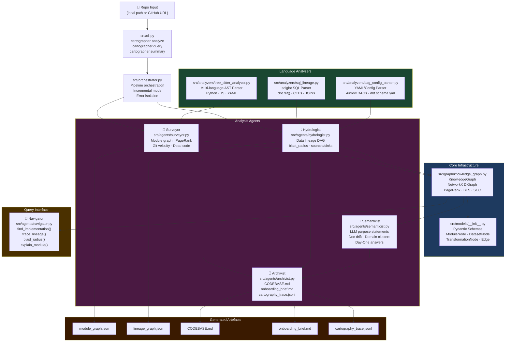

# 🗺️ Brownfield Cartographer

> **Multi-agent codebase intelligence system for rapid FDE onboarding in production environments.**
> Point it at any GitHub repo or local path. Get a living, queryable map of the system's architecture, data flows, and semantic structure in under 60 seconds.

---

## Quick Start

```bash
# 1. Clone the repo
git clone https://github.com/Meseretbolled/brownfield-cartographer.git
cd brownfield-cartographer

# 2. Create virtual environment and install
uv sync
source .venv/bin/activate

# 3. Run analysis on any repo
cartographer analyze /path/to/repo

# 4. Run analysis on a GitHub URL (auto-clones)
cartographer analyze https://github.com/dbt-labs/jaffle_shop

# 5. Launch interactive query interface
cartographer query /path/to/repo

# 6. Print summary of existing analysis
cartographer summary /path/to/repo
```

---

## Verify It Works

Run these commands to confirm everything is working end-to-end:

```bash
# 1. Check the CLI is installed and responds
cartographer --help

# 2. Run against the included jaffle_shop artefacts (no cloning needed)
cartographer query . --cartography-dir cartography-artifacts/jaffle_shop

# 3. Inside the query interface, try:
navigator> sources
navigator> sinks
navigator> blast_radius orders
navigator> module schema
navigator> quit

# 4. Run a fresh analysis against jaffle_shop
git clone https://github.com/dbt-labs/jaffle_shop /tmp/jaffle_shop
cartographer analyze /tmp/jaffle_shop

# 5. Inspect generated artefacts
ls /tmp/jaffle_shop/.cartography/
cat /tmp/jaffle_shop/.cartography/analysis_summary.md
```

---

## What It Does

The Cartographer runs four agents in sequence against any codebase:

| Agent | Role | Output |
| --- | --- | --- |
| **Surveyor** | Static AST analysis — module graph, PageRank, git velocity, dead code | `module_graph.json` |
| **Hydrologist** | Data lineage — Python dataflow, SQL (sqlglot), YAML/DAG configs, notebooks | `lineage_graph.json` |
| **Semanticist** | LLM purpose statements, doc drift detection, domain clustering, Day-One answers | `semanticist_trace.json` |
| **Archivist** | Produces all final artefacts — CODEBASE.md, onboarding brief, audit log | `CODEBASE.md`, `onboarding_brief.md` |

The **Navigator** agent provides an interactive query interface over the generated knowledge graph.

---

## Commands

### `analyze` — Full pipeline

```bash
cartographer analyze <repo>

# Options:
#   --output, -o        Custom output directory (default: <repo>/.cartography/)
#   --incremental, -i   Only re-analyse files changed since last run
#   --git-days          Days of git history for velocity (default: 30)

# Examples:
cartographer analyze /tmp/jaffle_shop
cartographer analyze https://github.com/dbt-labs/jaffle_shop
cartographer analyze /tmp/jaffle_shop --output ./my-output --git-days 60
cartographer analyze /tmp/jaffle_shop --incremental
```

### `query` — Interactive Navigator

```bash
cartographer query <repo>

# Inside the navigator:
blast_radius <node>          # All downstream dependents
lineage <dataset>            # Upstream sources of a dataset
module <path>                # Full detail on a module
sources                      # All data ingestion entry points
sinks                        # All data output endpoints
hubs                         # Top modules by PageRank
quit                         # Exit
```

### `summary` — Quick summary

```bash
cartographer summary <repo>
```

---

## Generated Artefacts

Every analysis run produces these files in `.cartography/`:

| File | Description |
| --- | --- |
| `module_graph.json` | Full module import graph with PageRank scores |
| `lineage_graph.json` | Data lineage DAG (datasets + transformations) |
| `analysis_summary.md` | Human-readable run summary |
| `CODEBASE.md` | Living context file — inject into any AI coding agent |
| `onboarding_brief.md` | Five FDE Day-One questions answered with evidence |
| `cartography_trace.jsonl` | Audit log of every agent action |

---

## Architecture



---

## Project Structure

```
brownfield-cartographer/
├── src/
│   ├── cli.py                          # Entry point: analyze, query, summary
│   ├── orchestrator.py                 # Pipeline wiring + incremental mode
│   ├── models/__init__.py              # Pydantic schemas (all node/edge types)
│   ├── graph/knowledge_graph.py        # NetworkX wrapper + serialization
│   ├── analyzers/
│   │   ├── tree_sitter_analyzer.py     # Multi-language AST parsing
│   │   ├── sql_lineage.py              # sqlglot SQL dependency extraction
│   │   └── dag_config_parser.py        # Airflow/dbt YAML config parsing
│   └── agents/
│       ├── surveyor.py                 # Module graph, PageRank, git velocity
│       ├── hydrologist.py              # Data lineage graph
│       ├── semanticist.py              # LLM purpose statements, doc drift
│       ├── archivist.py                # CODEBASE.md, onboarding brief
│       └── navigator.py               # Interactive query agent
├── cartography-artifacts/
│   └── jaffle_shop/                    # Pre-generated artefacts (jaffle_shop)
│       ├── module_graph.json
│       ├── lineage_graph.json
│       └── analysis_summary.md
├── pyproject.toml
└── README.md
```

---

## Supported Languages & Patterns

| Language | What's Extracted |
| --- | --- |
| **Python** | Imports, functions, classes, pandas/PySpark/SQLAlchemy dataflow |
| **SQL / dbt** | Table dependencies, CTEs, JOINs, `ref()` calls |
| **YAML** | Airflow DAG topology, dbt `schema.yml` sources and models |
| **Jupyter** | `.ipynb` cell source — read/write data references |
| **JavaScript/TypeScript** | AST parsing (imports, exports) |

---

## Environment Variables

```bash
# LLM model selection (Semanticist agent)
ANTHROPIC_API_KEY=sk-ant-...          # Required for LLM features
CARTOGRAPHER_FAST_MODEL=claude-haiku-4-5-20251001   # Bulk summaries
CARTOGRAPHER_STRONG_MODEL=claude-haiku-4-5-20251001 # Synthesis tasks
CARTOGRAPHER_DOMAIN_K=6               # Number of domain clusters
```

> LLM features are **optional**. All static analysis (Surveyor + Hydrologist) works without any API key.

---

## Target Codebases Tested

| Repo | Modules | Datasets | Transformations |
| --- | --- | --- | --- |
| [dbt jaffle_shop](https://github.com/dbt-labs/jaffle_shop) | 3 | 9 | 5 |

---

## Dependencies

Key dependencies (see `pyproject.toml` for full list):

- `tree-sitter` — multi-language AST parsing
- `sqlglot` — SQL parsing and lineage extraction
- `networkx` — graph construction, PageRank, BFS
- `pydantic` — schema validation
- `typer` + `rich` — CLI and terminal output
- `gitpython` — git history analysis
- `anthropic` — LLM calls (optional)
